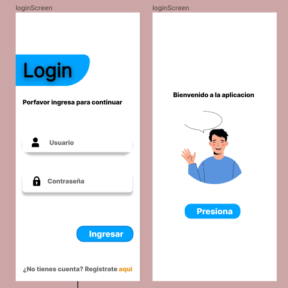

# Mi Aplicación React Native

¡Bienvenido a mi aplicación React Native! Esta aplicación es una demostración básica de una aplicación de inicio de sesión y pantalla principal.

## Capturas de Pantalla


*Pantalla de Inicio de Sesión y principal*

## Ejecutar la Aplicación

1. **Clonar el Repositorio:**
```
git clone https://github.com/adrianrochacon10/said.git
```

2. **Instalar Dependencias:**
```
cd tu-repositorio
npm install
```

3. **Ejecutar en Dispositivo Android/iOS:**
```
npm run android
```
o
```
npm run ios
```

## Recursos Adicionales

- [Documentación de React Native](https://reactnative.dev/docs/getting-started)
- [Documentación de React Navigation](https://reactnavigation.org/docs/getting-started)

